# Welcome to GenAI-Logic

Thankyou for installing!  We very much appreciate your interest, and are determined to make your experience as productive as possible.

Issues?  Email us at `support@genai-logic.com`

&nbsp;

## Prerequisites for installing API-in-a-Box™

It is recommended to get a local copy of WebGenAI:
1. Choose an install location (e.g., `~/dev/genai-logic`)
    * This should have sufficient disk space for your systems, including the databases
2. Download and unzip this project, either [from here](https://github.com/GenAI-Logic/genai_logic) (see screenshot at end), or using curl:
```bash
cd genai-logic
curl -LJO https://github.com/GenAI-Logic/genai-logic/archive/refs/heads/main.zip
unzip genai-logic-main.zip
cd genai-logic-main
```
3. We'll use a local editor to open the you IDE to this location
4. Update your `webgenai/docker-compose-webg.yml`:
    1. Copy the license key you received in the registration email over: `- GENAI_LOGIC_APIKEY=<paste license here from registration email>`
        * If you have not already registered, please visit the [registration page](http://registration-genailogic.com/registration.html) to obtain a license key.
    5. GenAI-Logic uses OpenAI, which requires an Open API Key:
        1. Obtain a Key
            1. Obtain one from [here](https://platform.openai.com/account/api-keys) or [here](https://platform.openai.com/api-keys)
            2. Authorize payments [here](https://platform.openai.com/settings/organization/billing/overview)
        2. Update the key in this line: `- APILOGICSERVER_CHATGPT_APIKEY=<sk-proj-your-openai-key-here>`.


&nbsp;

## Login into your TerraMaster NAS

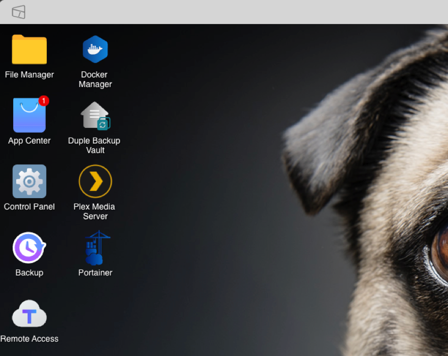

It is recommended to have a DNS name associated to your TNAS (TerraMaster network attached storage) device.  To do this, you can edit your `/etc/hosts` file adding the IP address for your TNAS.  

```bash
...
<XXX.XXX.XXX.XXX>      my-tnas          my-tnas.local
...
```

Replace <XXX.XXX.XXX.XXX> with the actual IP address of your TNAS device.  When providing a name for your TNAS, you can immediately access the device from your browser using that name.  E.g., `http://my-tnas.local:5443`  Be aware, you may get a warning in your browser when using `http` vs. `https` until such a time when you implement SSL/TLS certificates.  You will be redirected to the Login screen, if not already authenticated to the device.

&nbsp;

## Open Docker Manager app within your TNAS Desktop

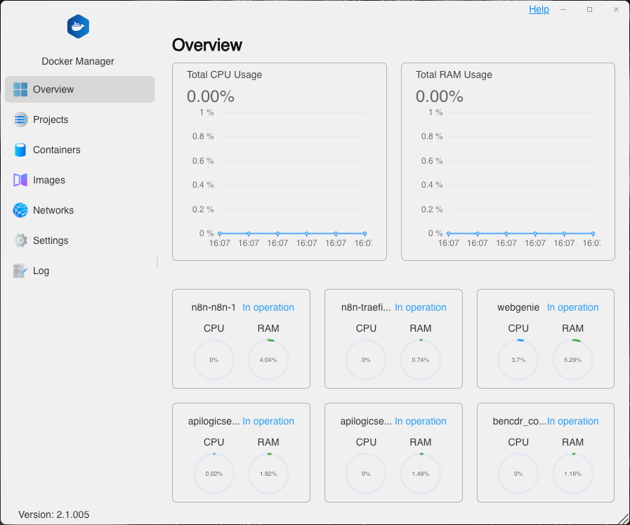

Open Docker Manager and switch to the Projects tab.  


Add a new Project by clicking the [+] plus button at the top edge of the Projects list.  The Create Project dialog opens.

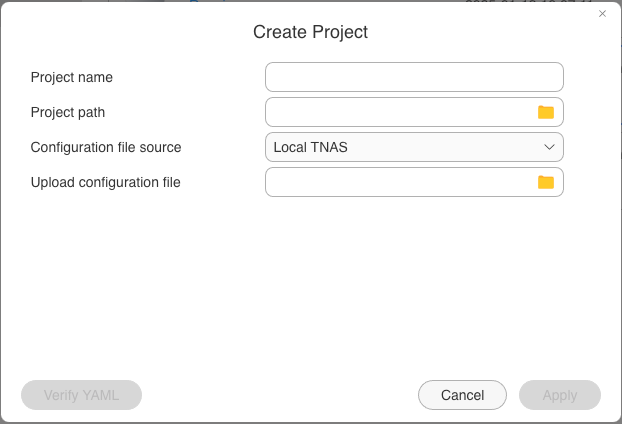

Complete the form by gibing your project a name (e.g., `my-web-genie`) and select the path for your project.  Click the [+] button at the top edge of the Directory list to add a sub-folder.  Select the sub-folder and click [Apply] button to apply the path to your project.

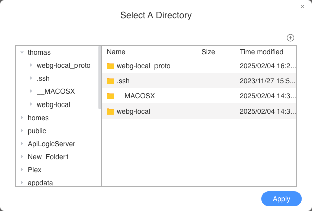

Update your projects `yaml` file by selecting the dropdown menu and specify `Create a YAML file` from the list.  In the edit form, paste your edited `yaml` file.  You must click the [Verify YAML] button before clicking [Apply]

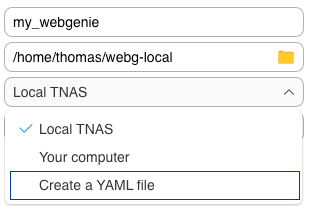

The docker project is built and the Docker Manager will attempt start the project.


If your project is started successfully, you'll see your new Project listed in the Projects list and it will be marked as `Running...`.  To stop or restart your project, use the controls along the top edge of the Projects list.

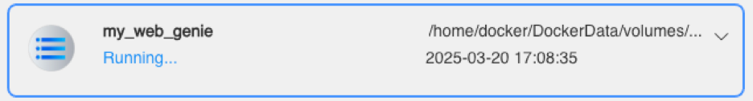

## Edit Project in Docker Manager

You cannot edit a project while it is running, you must stop the project first.  Hover your mouse over the controls along the top of the list, to see a callout showing each button's purpose.  You'll see the `Edit` button highlight only after selecting the Project tile in the list and only if that Project is `Stopped`.  When Editing a project, a user can only edit the project's `yaml` file.  E.g., updating your `APILOGICSERVER_CHATGPT_APIKEY` or `GENAI_LOGIC_APIKEY` can easily be accomplished in this way.  Users are prohibited from updating the other setting within the project.  Therefore, to change a project's path, or rename your project, you simply delete it and recreate the project again.

## To Run WebGenAI

Once you have installed (above), start the server:

```bash
sh run_web_genai.sh
```

Open your browser at [http://localhost:8282](http://localhost:8282).

Find the [documentation here](https://apilogicserver.github.io/Docs/WebGenAI/).

&nbsp;

## Verify the installation

Open your browser at [http://localhost:8282/admin-app/#/Home?demo=genai_demo](http://localhost:8282/admin-app/#/Home?demo=genai_demo), and follow these steps:

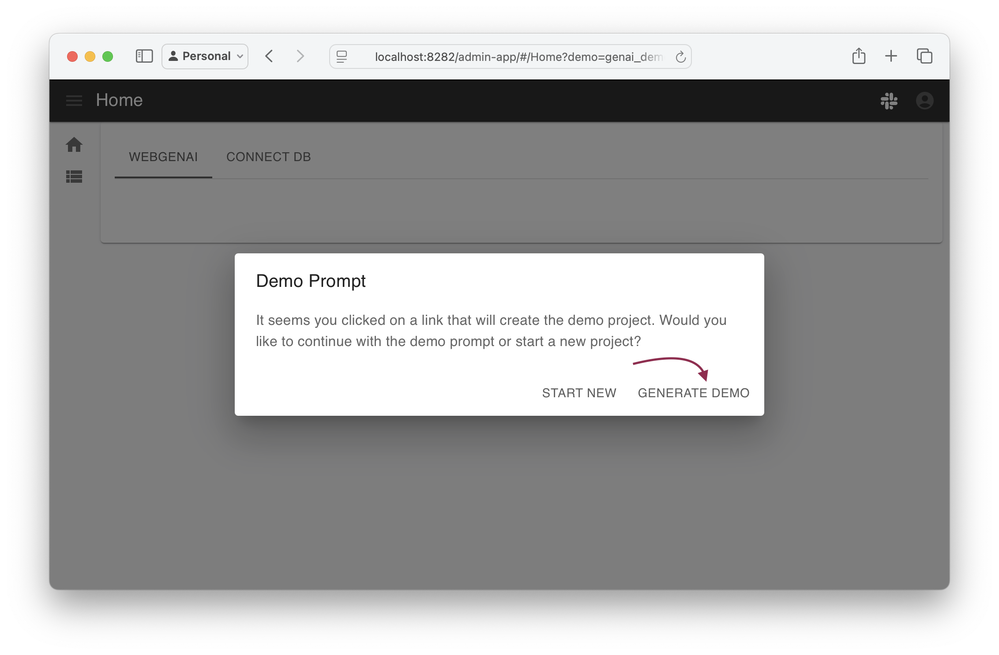

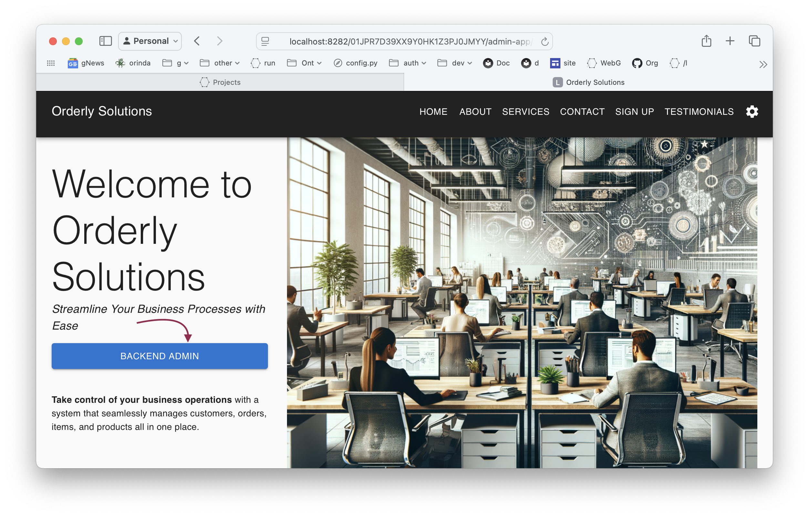
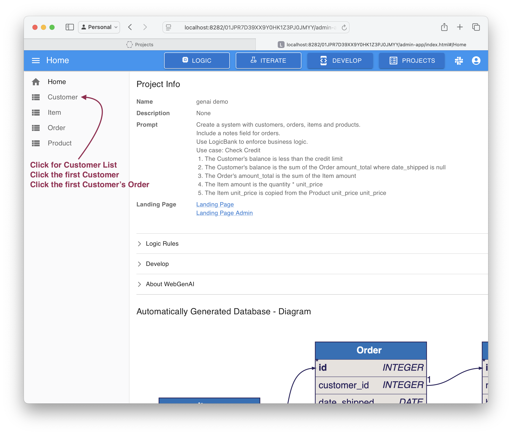
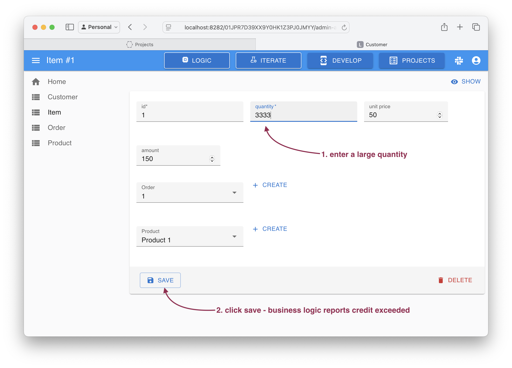

The constraint is produced by the business logic:
* The quantity change recomputed the amount (rule 4)
* The amount adjusted the amount_total (rule 3)
* The amount_total adjusted the balance (rule 2)
* The balance exceeded the credit limit (rule 1), which produced the message and reverted the transaction

```bash
Use case: Check Credit    
    1. The Customer's balance is less than the credit limit
    2. The Customer's balance is the sum of the Order amount_total where date_shipped is null
    3. The Order's amount_total is the sum of the Item amount
    4. The Item amount is the quantity * unit_price
    5. The Item unit_price is copied from the Product unit_price
```

&nbsp;

## Run WebGenAI samples

After installation, you can try the sample prompts at `samples/web-genai-samples`.

&nbsp;

## Run API Logic Server samples 

Installation not required.

Your install includes a few sample systems at: samples.

To run the default sample:

```bash
sh run_sample.sh nw_sample
```

And then open your browser at [http://localhost:5656](http://localhost:5656).

To run a different sample, replace `nw_sample` with the sample directory.  Only 1 sample can be running at a time.

| Sample | Notes   |
| :------------- | :------------- |
| nw_sample | Our take on Northwind (Customers, Orders etc), **with logic.**<br>&nbsp;&nbsp;&nbsp;&nbsp;1. Illustrates key functionality<br>&nbsp;&nbsp;&nbsp;&nbsp;2. Extensive [Tutorial](https://apilogicserver.github.io/Docs/Tutorial/) and code/logic examples |
| nw_sample_nocust | Uncustomized version of nw, created in about 5-10 seconds.<br>&nbsp;&nbsp;&nbsp;&nbsp;* Illustrates results you should obtain using your existing databases |

&nbsp;

## Creating projects from existing databases

Coming soon

&nbsp;

## Debugging Projects in VSCode

Coming soon

## Acquire from git

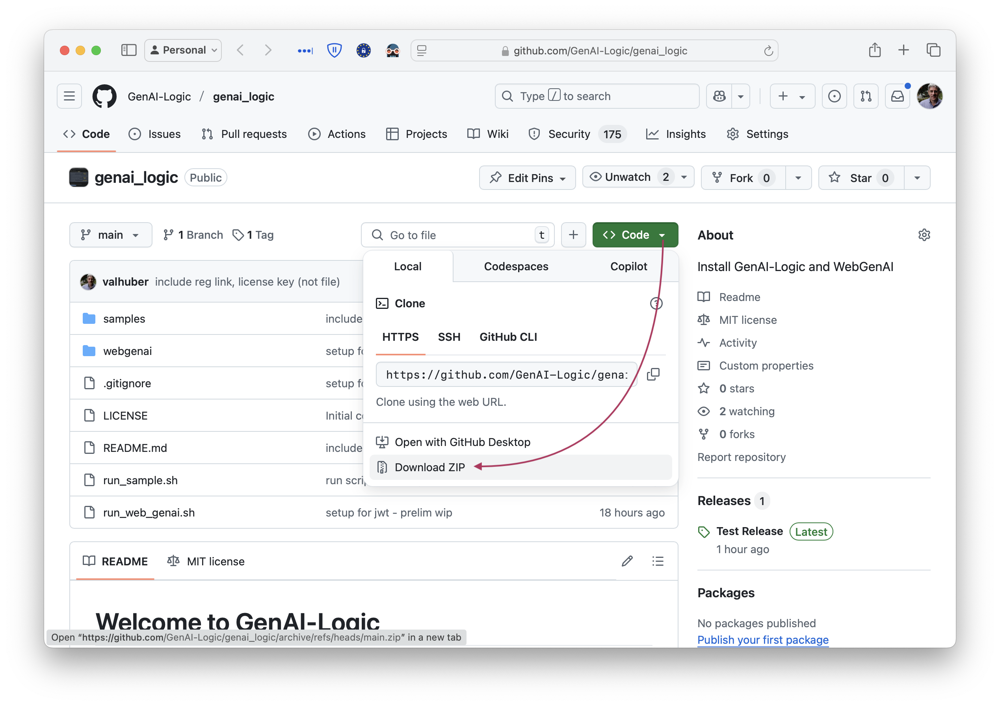
