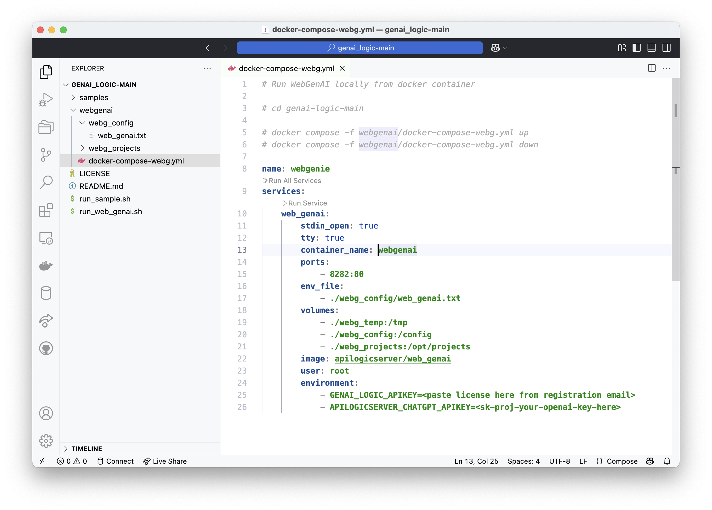

# Welcome to GenAI-Logic

Thankyou for installing!  We very much appreciate your interest, and are determined to make your experience as productive as possible.

Issues?  Email us at `support@genai-logic.com`

&nbsp;

## Install GenAI-Logic and WebGenAI

To install WebGenAI:
1. Choose an install location (e.g., `~/dev/genai-logic)
    * This should have sufficient disk space for your systems, including the databases
2. Download and unzip this project, either [from here]https://github.com/GenAI-Logic/genai_logic) (see screenshot at end), or using curl:
```bash
cd genai-logic
curl -LJO https://github.com/GenAI-Logic/genai-logic/archive/refs/heads/main.zip
unzip genai-logic-main.zip
cd genai_logic-main
```
3. While not required, you may wish to open your IDE to this location
4. Copy the license key you received in the registration email into: `webgenai/docker-compose-webg.yml` 
    * If you have not already registered, please visit the [registration page](http://registration-genailogic.com/registration.html) to obtain a license key.
5. GenAI-Logic uses OpenAI, which requires an Open API Key:
    1. Obtain a Key
        1. Obtain one from [here](https://platform.openai.com/account/api-keys) or [here](https://platform.openai.com/api-keys)
        2. Authorize payments [here](https://platform.openai.com/settings/organization/billing/overview)
    2. Update this file with your OpenAI API Key: `webgenai/docker-compose-webg.yml`.



&nbsp;

## To Run WebGenAI

Once you have installed (above):

```bash
sh run_web_genai.sh
```

Open your browser at [http://localhost:8282](http://localhost:8282).

Find the [documentation here](https://apilogicserver.github.io/Docs/WebGenAI/).

&nbsp;

## Run WebGenAI samples

After installation, you can try the sample prompts at `samples/web-genai-samples`.

&nbsp;

## Run API Logic Server samples 

Installation not required.

Your install includes a few sample systems at: samples.

To run the default sample:

```bash
sh run_sample.sh nw_sample
```

And then open your browser at [http://localhost:5656](http://localhost:5656).

To run a different sample, replace `nw_sample` with the sample directory.  Only 1 sample can be running at a time.

| Sample | Notes   |
| :------------- | :------------- |
| nw_sample | Our take on Northwind (Customers, Orders etc), **with logic.**<br>&nbsp;&nbsp;&nbsp;&nbsp;1. Illustrates key functionality<br>&nbsp;&nbsp;&nbsp;&nbsp;2. Extensive [Tutorial](https://apilogicserver.github.io/Docs/Tutorial/) and code/logic examples |
| nw_sample_nocust | Uncustomized version of nw, created in about 5-10 seconds.<br>&nbsp;&nbsp;&nbsp;&nbsp;* Illustrates results you should obtain using your existing databases |

&nbsp;

## Creating projects from existing databases

TBD

&nbsp;

## Debugging Projects in VSCode

TBD

## Acquire from git


