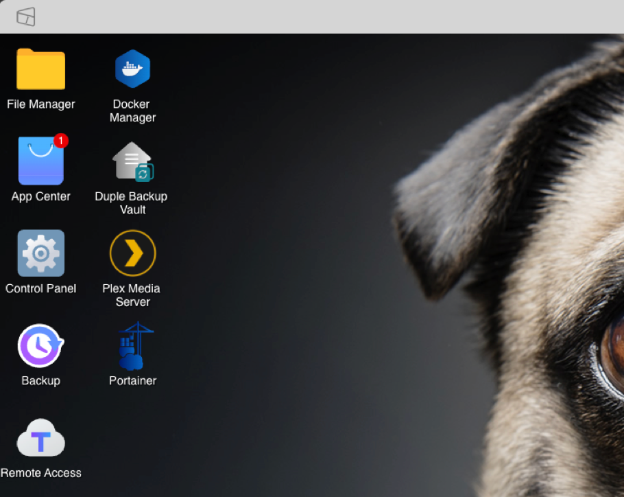
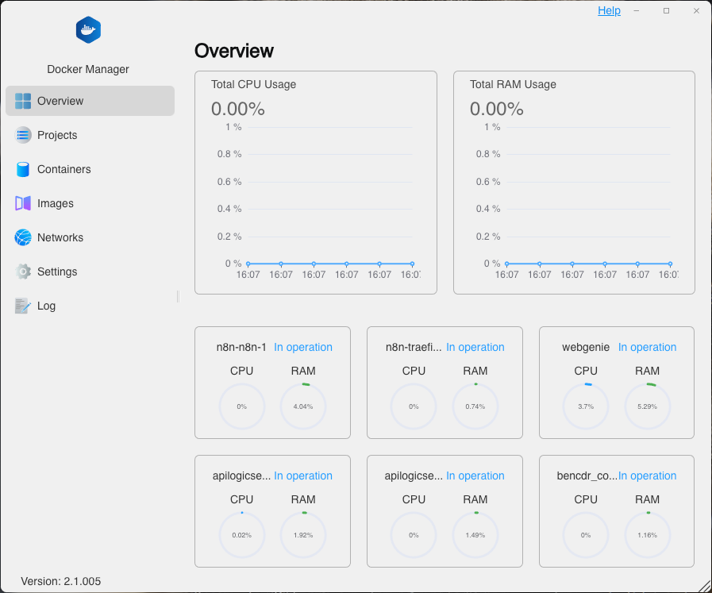
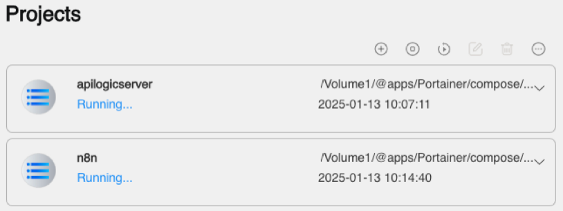
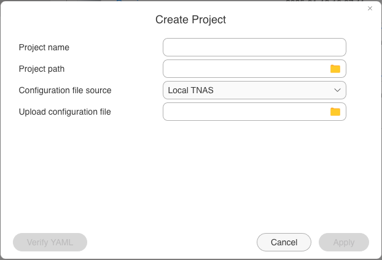
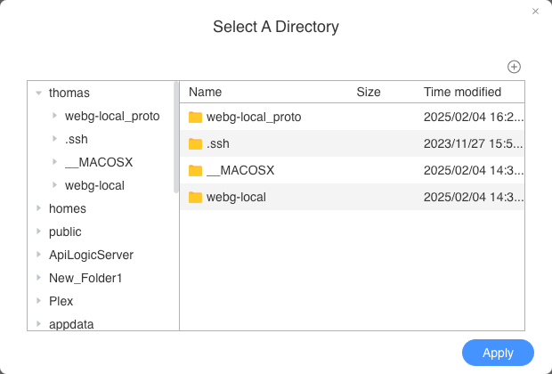
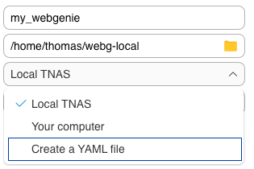
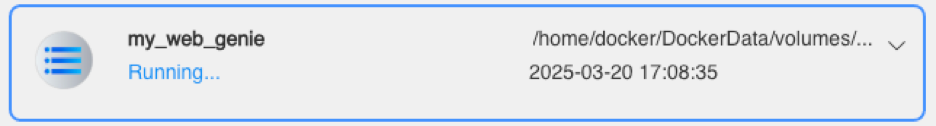
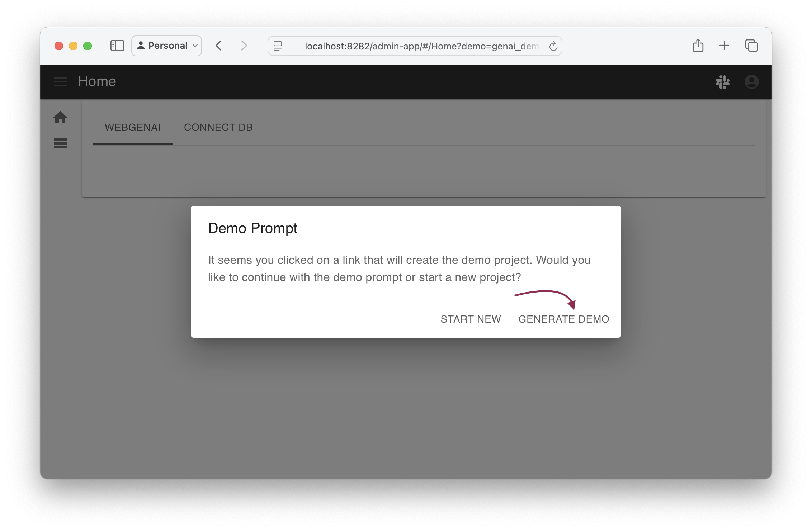
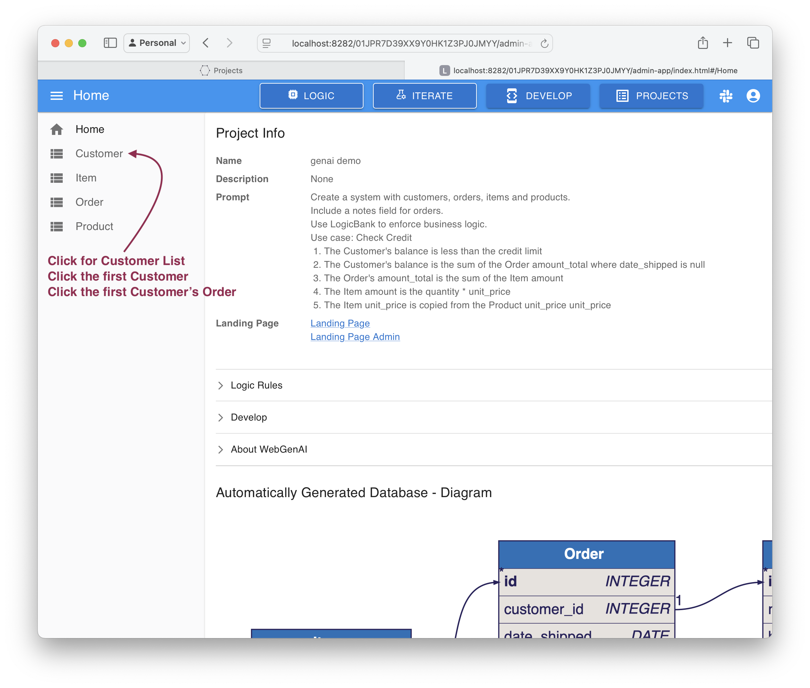
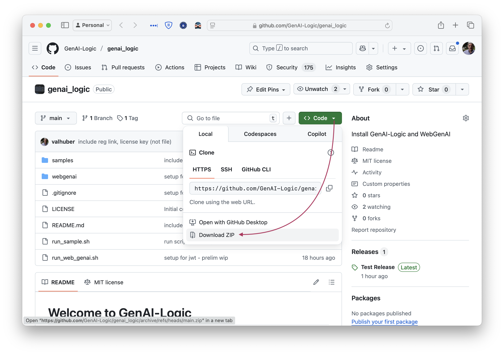

# Welcome to API-in-a-Box™

Thank you for installing!

&nbsp;

API-in-a-Box™ is the community edition of [WebGenAI](https://www.genai-logic.com/product/kickstart-with-logic-dev-friendly) by [GenAI Logic](https://www.genai-logic.com/) installed on your TerraMaster TNAS device.  We very much appreciate your interest, and are determined to make your experience as productive as possible.

For any issues, please use the online community support forum [Community support](https://forum.terra-master.com/en/viewforum.php?f=109&sid=d0e3c7024814a419da46aa8ffca51a97) moderated by [Imagery Business Systems, LLC](https://imagery-business-systems.com/api-in-a-box)

&nbsp;

## Prerequisites

Before installing, you should have installed Docker Engine and the Docker Manager into your TNAS device.  In addition to Docker, it's recommended to get a local copy of WebGenAI.  Although it is not required, if you like, you can simple grab a copy of the online [docker compose](https://github.com/GenAI-Logic/genai-logic/blob/API-in-a-Box/webgenai/docker-compose-webg.yml) file.
1. Just save the file, or download the project to a local folder (e.g., `~/dev/genai-logic`)
    * Your TNAS should have sufficient disk space for WebGenAI to store its contents, including the internal database used to manage your projects.
2. Now, optionally download and unzip the project, either [from here](https://github.com/GenAI-Logic/genai_logic) (see screenshot at end), or using the following commands in your terminal app:
```bash
cd genai-logic
curl -LJO https://github.com/GenAI-Logic/genai-logic/archive/refs/heads/main.zip
unzip genai-logic-main.zip
cd genai-logic-main
```
3. You'll use a local editor to open the docker compose file, or open an IDE to this location.
4. Now, update your `webgenai/docker-compose-webg.yml`:
    1. Copy the license key you received in the registration email over: `- GENAI_LOGIC_APIKEY=<paste license here from registration email>`
        * If you have not already registered, please visit the [registration page](http://registration-genailogic.com/registration.html) to obtain a license key.
    5. GenAI-Logic uses OpenAI, which requires an Open API Key:
        1. Obtain a Key
            1. Obtain one from [here](https://platform.openai.com/account/api-keys) or [here](https://platform.openai.com/api-keys)
            2. Authorize payments [here](https://platform.openai.com/settings/organization/billing/overview)
        2. Update the key in this line: `- APILOGICSERVER_CHATGPT_APIKEY=<sk-proj-your-openai-key-here>`.


&nbsp;

## Login into your TerraMaster NAS



It is recommended to have a DNS name associated to your TNAS (TerraMaster network attached storage) device.  To do this, you can edit your `/etc/hosts` file adding the IP address for your TNAS.  

```bash
...
<XXX.XXX.XXX.XXX>      my-tnas          my-tnas.local
...
```

Replace `XXX.XXX.XXX.XXX` with the actual IP address of your TNAS device.  When providing a name for your TNAS, you can immediately access the device from your browser using that name.  E.g., [http://my-tnas.local:5443](http://my-tnas.local:5443)  Be aware, you may get a `-! Warning !-` in your browser when using `http` vs. `https` until such a time when you implement SSL/TLS certificates.  You you can bypass this warning, and proceed to the TNAS device.  Once you do, will be redirected to the Login screen, if not already authenticated.


&nbsp;

## Open Docker Manager app within your TNAS Desktop



Login to your TNAS devic and open Docker Manager by clicking the ICON on the TNAS Desktop, then switch to the Projects tab.  You will see a list of previouslly installed Docker Projects as shown below.



Now add a new Project by clicking the [+] plus button at the top edge of the Projects list.  The Create Project dialog opens as shown below.



Complete the form (all fields are required) by providing a project name (e.g., `my-web-genie`) and select the path for your project.  Click on the [Folder] icon to browse the TNAS file-system. In the Directory browser, navigate to the desired location for your project's home, then click the [+] button at the top edge of the Directory list to add a [sub-folder].  After creating it, select the sub-folder then click [Apply] to apply the path to your project.



Back in the Create Project dialog, update your projects `yaml` file by selecting the dropdown menu and specify `Create a YAML file` from the list.  A text editor is presented.  In the edit form, paste in your Docker Composer `yaml` file.  You must click [Verify YAML] before clicking [Apply].



The docker project is built and the Docker Manager will start the project.


If your project is started successfully, you'll see your new Project listed in the Docker Manager Projects list marked as `Running...`.  To stop or restart your project, use the controls along the top edge of the Projects list.



&nbsp;

## Edit Project in Docker Manager

When your project is running, you cannot edit it and you must first stop the project.  To become familiar with the TerraMaster Docker Manager, hover your mouse over each control along the top of the list to see its tooltip.  You'll see the `Edit` button highlight only after selecting the Project tile in the list and only if that Project is `Stopped`.  You can edit the configuration by updating the `yaml` file  E.g., updating your `APILOGICSERVER_CHATGPT_APIKEY` or `GENAI_LOGIC_APIKEY` can easily be accomplished in this way.  Users are prohibited from updating the other setting within the project.  Therefore, to change a project's path, or rename your project, you simply delete it and recreate the project again.


&nbsp;

## To Run WebGenAI

Once you have completed the install, (above), you can start WebGenAI.


Open your browser at [http://my-tnas.local:8282](http://my-tnas.local:8282).

Find the [documentation here](https://apilogicserver.github.io/Docs/WebGenAI/).

&nbsp;

## Verify the installation

Open your browser at [http://localhost:8282/admin-app/#/Home?demo=genai_demo](http://localhost:8282/admin-app/#/Home?demo=genai_demo), and follow these steps:







The constraint is produced by the business logic:
* The quantity change recomputed the amount (rule 4)
* The amount adjusted the amount_total (rule 3)
* The amount_total adjusted the balance (rule 2)
* The balance exceeded the credit limit (rule 1), which produced the message and reverted the transaction

```bash
Use case: Check Credit    
    1. The Customer's balance is less than the credit limit
    2. The Customer's balance is the sum of the Order amount_total where date_shipped is null
    3. The Order's amount_total is the sum of the Item amount
    4. The Item amount is the quantity * unit_price
    5. The Item unit_price is copied from the Product unit_price
```

&nbsp;

## Run WebGenAI samples

After installation, you can try the sample prompts at `samples/web-genai-samples`.

&nbsp;

## Run API Logic Server samples 

Installation not required.

Your install includes a few sample systems at: samples.

To run the default sample:

```bash
sh run_sample.sh nw_sample
```

And then open your browser at [http://localhost:5656](http://localhost:5656).

To run a different sample, replace `nw_sample` with the sample directory.  Only 1 sample can be running at a time.

| Sample | Notes   |
| :------------- | :------------- |
| nw_sample | Our take on Northwind (Customers, Orders etc), **with logic.**<br>&nbsp;&nbsp;&nbsp;&nbsp;1. Illustrates key functionality<br>&nbsp;&nbsp;&nbsp;&nbsp;2. Extensive [Tutorial](https://apilogicserver.github.io/Docs/Tutorial/) and code/logic examples |
| nw_sample_nocust | Uncustomized version of nw, created in about 5-10 seconds.<br>&nbsp;&nbsp;&nbsp;&nbsp;* Illustrates results you should obtain using your existing databases |

&nbsp;

## Creating projects from existing databases

Coming soon

&nbsp;

## Debugging Projects in VSCode

Coming soon

## Acquire from git


